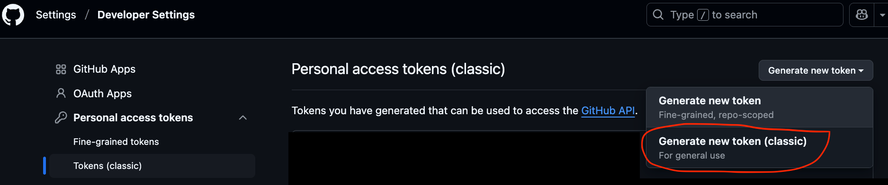

# dtx2X: an iStarDT-X deserializer

`dtx2X` is a Java-based system for deserializing iStar-DT-X XML models into a structured object model, called a [common object model](https://github.com/cmg-yorku/dtx2X/tree/main/docs/images/CommonObjectModel.png), and then into third-party formal specifications as per specified plug-ins. 

Currently a translator to DT-Golog, `dtx2dtg`, is included.

## Table of Contents
- [Features](#features)
- [Requirements](#requirements)
- [Installation](#installation)
- [Usage](#usage)
  - [Running the Application](#running-the-application)
- [Configuration](#configuration)
- [Testing](#testing)
- [Limitations/Future notes](#limitationsfuture-notes)

## Features

- XML validation against XSD and Schematron schemas
- Two-phase deserialization for resolving complex references
- Formula processing
- Common object model definition
- Translators: dtx2dtg

## Requirements

- Java 17 or higher
- Maven 3.6 or higher

## Installation

1. Clone the repository
2. Enter the project folder
3. Make a copy of `settingsExample.xml` and rename the copy to `settings.xml`
4. In `settings.xml`, add in your GitHub username and personal access token (classic) with `read:packages` scope
```xml
<servers>
  <server>
    <id>github</id>
    <username>GITHUB_USERNAME</username>
    <password>GITHUB_PERSONAL_ACCESS_TOKEN</password>
  </server>
</servers>
```

To make a personal access token (classic) on GitHub: Settings > Developer Settings > Personal access tokens > Tokens (classic) > Generate new token


https://docs.github.com/en/packages/learn-github-packages/about-permissions-for-github-packages#visibility-and-access-permissions-for-packages
> In most registries, to pull a package, you must authenticate with a personal access token or GITHUB_TOKEN, regardless of whether the package is public or private.

> To download and install packages from a repository, your personal access token (classic) must have the read:packages scope, and your user account must have read permission.
5. Install the project’s artifacts into your local Maven repository using your custom authentication settings:

```bash
mvn clean install -s settings.xml
```

<!-- 
6. To run the main application (IStarTApplication), run:

```bash
mvn exec:java
```
-->

## Usage

### Running the Application

The validation and unmarshalling components are currently usable through a specific translation context. We have specifically implemented a translation to DT-Golog accessed through `dtx2dtg` whose main function is invoked under the current `pom.xml` configuration.

In the root directory:
```
mvn exec:java -Dexec.args="-f [path to ISTARDT input file] -o [path to DT-Golog out spec  -PL file]
```

For example:

```
exec:java -Dexec.args="-f ./src/main/resources/xml/Heating.istardt -o ../dtg2sim-new/src/Heating.pl"
```

or (on windows)
```
dtx2dtg -f ./src/main/resources/xml/Heating.istardt -o ../dtg2sim-new/src/Heating.pl
```

### Options

You can have the application perform only validation `-v` (skips translation)  or only translation `-t` (skips validation - not recommended). Option `-p` prints detailed model information on screen.

Use the `-h` to display these additional options. 

```
Usage: dtx2dtg [-options]
where options are:
    -f filename          iStarDT-X XML file
    -o filename          DT-Golog PL file
	-t                   translate only (skip validation)
    -t                   validate only (skip tranlsation)
    -p                   print model info (forces unmarshalling)
    -h                   prints this help
```


<!--
The main application reads an XML file, validates it against both XSD and Schematron schemas, and prints model information:


```bash
mvn exec:java
```

This will use the default XML file specified in `IStarTApplication.java` (figure1a_fixed2.xml).

To use different input files, you'll need to modify the file path constants in `IStarTApplication.java`:
```java
public class IStarTApplication {

  private static final String XSD_SCHEMA_PATH = "src/main/resources/xsd/istar-rl-schema_v3.xsd";
  private static final String SCHEMATRON_SCHEMA_PATH = "src/main/resources/schematron/istar-rl-schematron3.sch";
  private static final String XML_FILE_PATH = "src/main/resources/xml/figure1a_fixed2.xml";
  // ...
}
```

## Project Structure

```
.
├── README.md
├── pom.xml
├── settingsExample.xml
├── .gitignore
├── docs
   ├── README.md
   ├── bnf_grammar.md
   ├── domain_model_uml.md
   ├── domain_model_uml.png
   ├── domain_model_uml.uml
   ├── images
   ├── sequence_diagram_deserialization_system.md
   └── xml_uml.md
├── src
   ├── main
     ├── java
        └── ca
          └── yorku
            └── cmg
              └── istardt
                └── xmlparser
                  ├── IStarTApplication.java  # Main application
                  ├── XmlValidation.java
                  ├── objects         # Domain model
                    ├── ANDOperator.java
                    ├── Actor.java
                    ├── Atom.java
                    ├── Condition.java
                    ...
                  └── xml
                    ├── IStarUnmarshaller.java
                    ├── ReferenceResolver.java
                    ├── deserializers
                      ├── ActorDeserializer.java
                      ├── BaseDeserializer.java
                      ...
                    ├── formula
                      ├── FormulaNodeVisitor.java
                      └── FormulaNodeVisitorImpl.java
                    ├── processing
                      └── ReferenceProcessor.java
                    └── utils
                      └── DeserializerUtils.java
     └── resources
       ├── schematron
       ├── textualRep_figure1a.txt
       ├── textualRep_figure1b.txt
       ├── xml
       └── xsd
   └── test
     ├── java
       └── ca
         └── yorku
           └── cmg
             └── istardt
               └── xmlparser
                 └── IStarUnmarshallerTest.java
     └── resources
       ├── schematron
       ├── xml
       └── xsd
```

## Architecture

The system has the following main components:

1. **Validation**: XML validation against schemas
2. **Unmarshalling**: Conversion of XML to Java objects
3. **Reference Resolution**: Establishing relationships between objects
--> 
## Configuration

Configuration is handled through the Maven POM file. The main configurable elements are:

- Java version (currently set to Java 17)
- Jackson dependencies
- [XML validation library](https://github.com/nina2dv/xml-istar-rl)

## Testing

Run the tests with:

```bash
mvn test
```

## Related tools

The generated ``DT-Golog`` specification is usable by both [`DT-Golog`](https://www.cs.ryerson.ca/~mes/publications/mainLetter.pdf) for model-based discrete space reasoning and for simulation and reinforcement learning using [`dtg2sim`](https://github.com/cmg-yorku/dtg2sim).

## Notes and Limitations

- Current XSD defines 1 actor per model.

## Contact
For queries, issues, and recommendations contact [liaskos@yorku.ca](mailto: liaskos@yorku.ca)