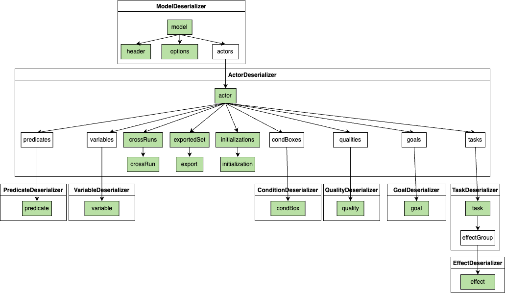

## Documentation Files

### bnf_grammar.md
Provides a Backus-Naur Form (BNF) grammar specification for the iStarDT-X XML format. This formal notation describes the syntax rules of the XML language used in the project, detailing the structure of elements such as actors, goals, tasks, and formulas.

### domain_model_uml (.png, .uml)
Contains a UML class diagram of the iStar-DT Java domain model.

### sequence_diagram_deserialization_system.md
Contains a sequence diagram illustrating the XML deserialization process. This diagram shows the interaction between different components of the system during the deserialization of an XML file, including validation, unmarshalling, and reference resolution phases.

### istardt_unmarshalling.png

The XML parsing and unmarshalling process is a preorder traversal, starting from the root “model” node. 
It also shows which deserializer handles which element and to which other deserializer it delegates. 
The green-coloured nodes represent XML elements corresponding to their respective Java classes

## Using the Documentation

- To follow the XML format, refer to `bnf_grammar.md`.
- For details on the domain model implementation, see `domain_model_uml.md`.
- For a visual representation of the deserialization process, see `sequence_diagram_deserialization_system.md`.