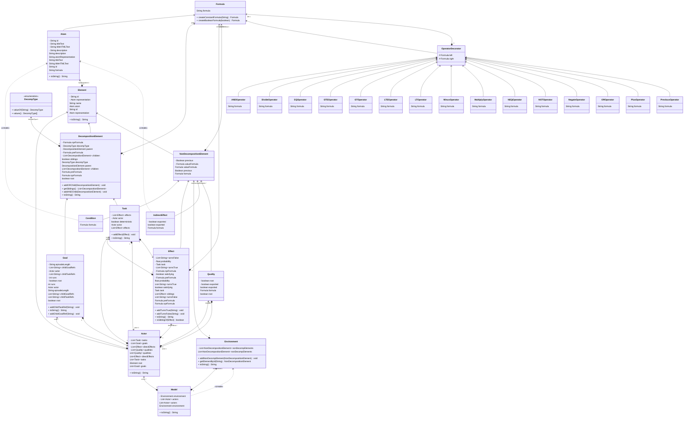

```mermaid
classDiagram
direction BT
class ANDOperator {
   String formula
}
class Actor {
  - List~Task~ tasks
  - List~Goal~ goals
  - List~Effect~ directEffects
  - List~Quality~ qualities
  + toString() String
   List~Quality~ qualities
   List~Effect~ directEffects
   List~Task~ tasks
   Element root
   List~Goal~ goals
}
class Atom {
  - String id
  - String titleText
  - String titleHTMLText
  - String description
  + toString() String
   String description
   String atomRepresentation
   String titleText
   String titleHTMLText
   String id
   String formula
}
class Condition {
   Formula formula
}
class DecompType {
<<enumeration>>
  + valueOf(String) DecompType
  + values() DecompType[]
}
class DecompositionElement {
  - Formula nprFormula
  - DecompType decompType
  - DecompositionElement parent
  - Formula preFormula
  - List~DecompositionElement~ children
  + addORChild(DecompositionElement) void
  + getSiblings() List~DecompositionElement~
  + addANDChild(DecompositionElement) void
  + toString() String
   boolean siblings
   DecompType decompType
   DecompositionElement parent
   List~DecompositionElement~ children
   Formula preFormula
   Formula nprFormula
   boolean root
}
class DivideOperator {
   String formula
}
class EQOperator {
   String formula
}
class Effect {
  - List~String~ turnsFalse
  - float probability
  - Task task
  - List~String~ turnsTrue
  - Formula nprFormula
  - boolean satisfying
  - Formula preFormula
  + addTurnsTrue(String) void
  + addTurnsFalse(String) void
  + toString() String
  + isSiblingOf(Effect) boolean
   float probability
   List~String~ turnsTrue
   boolean satisfying
   Task task
   List~Effect~ siblings
   List~String~ turnsFalse
   Formula preFormula
   Formula nprFormula
}
class Element {
  - String id
  - Atom representation
  + toString() String
   String name
   Atom atom
   String id
   Atom representation
}
class Environment {
  - List~NonDecompositionElement~ nonDecompElements
  + addNonDecompElement(NonDecompositionElement) void
  + getElementById(String) NonDecompositionElement
  + toString() String
   List~NonDecompositionElement~ nonDecompElements
}
class Formula {
  + createConstantFormula(String) Formula
  + createBooleanFormula(boolean) Formula
   String formula
}
class GTEOperator {
   String formula
}
class GTOperator {
   String formula
}
class Goal {
  - String episodeLength
  - List~String~ childGoalRefs
  - Actor actor
  - List~String~ childTaskRefs
  - int runs
  - boolean root
  + addChildTaskRef(String) void
  + toString() String
  + addChildGoalRef(String) void
   int runs
   Actor actor
   String episodeLength
   List~String~ childGoalRefs
   List~String~ childTaskRefs
   boolean root
}
class IndirectEffect {
  - boolean exported
   boolean exported
   Formula formula
}
class LTEOperator {
   String formula
}
class LTOperator {
   String formula
}
class MinusOperator {
   String formula
}
class Model {
  - Environment environment
  - List~Actor~ actors
  + toString() String
   List~Actor~ actors
   Environment environment
}
class MultiplyOperator {
   String formula
}
class NEQOperator {
   String formula
}
class NOTOperator {
   String formula
}
class NegateOperator {
   String formula
}
class NonDecompositionElement {
  - Boolean previous
  - Formula valueFormula
   Formula valueFormula
   Boolean previous
   Formula formula
}
class OROperator {
   String formula
}
class OperatorDecorator {
  # Formula left
  # Formula right
}
class PlusOperator {
   String formula
}
class PreviousOperator {
   String formula
}
class Quality {
  - boolean root
  - boolean exported
   boolean exported
   Formula formula
   boolean root
}
class Task {
  - List~Effect~ effects
  - Actor actor
  + addEffect(Effect) void
  + toString() String
   boolean deterministic
   Actor actor
   List~Effect~ effects
}

ANDOperator  -->  OperatorDecorator 
Actor "1" *--> "directEffects *" Effect 
Actor  -->  Element 
Actor "1" *--> "goals *" Goal 
Actor "1" *--> "qualities *" Quality 
Actor "1" *--> "tasks *" Task 
Atom  -->  Formula 
Condition  ..>  Atom : «create»
Condition  -->  NonDecompositionElement 
DecompositionElement "1" *--> "decompType 1" DecompType 
DecompositionElement  -->  Element 
DecompositionElement "1" *--> "preFormula 1" Formula 
DivideOperator  -->  OperatorDecorator 
EQOperator  -->  OperatorDecorator 
Effect "1" *--> "preFormula 1" Formula 
Effect  -->  NonDecompositionElement 
Effect "1" *--> "task 1" Task 
Element "1" *--> "representation 1" Atom 
Environment "1" *--> "nonDecompElements *" NonDecompositionElement 
GTEOperator  -->  OperatorDecorator 
GTOperator  -->  OperatorDecorator 
Goal "1" *--> "actor 1" Actor 
Goal  -->  DecompositionElement 
IndirectEffect  ..>  Atom : «create»
IndirectEffect  -->  NonDecompositionElement 
LTEOperator  -->  OperatorDecorator 
LTOperator  -->  OperatorDecorator 
MinusOperator  -->  OperatorDecorator 
Model "1" *--> "actors *" Actor 
Model "1" *--> "environment 1" Environment 
Model  ..>  Environment : «create»
MultiplyOperator  -->  OperatorDecorator 
NEQOperator  -->  OperatorDecorator 
NOTOperator  -->  OperatorDecorator 
NegateOperator  -->  OperatorDecorator 
NonDecompositionElement  -->  Element 
NonDecompositionElement "1" *--> "valueFormula 1" Formula 
OROperator  -->  OperatorDecorator 
OperatorDecorator  -->  Formula 
OperatorDecorator "1" *--> "left 1" Formula 
PlusOperator  -->  OperatorDecorator 
PreviousOperator  -->  OperatorDecorator 
Quality "1" *--> "actor 1" Actor 
Quality  -->  NonDecompositionElement 
Task "1" *--> "actor 1" Actor 
Task  -->  DecompositionElement 
Task "1" *--> "effects *" Effect 
```