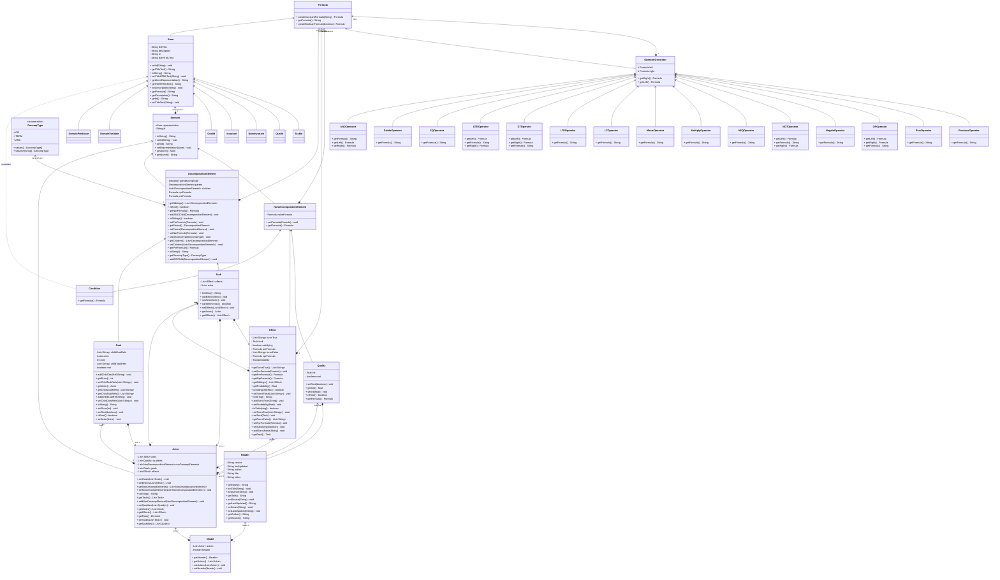

```mermaid
classDiagram
direction BT
class ANDOperator {
  + getFormula() String
  + getLeft() Formula
  + getRight() Formula
}
class Actor {
  - List~Task~ tasks
  - List~Quality~ qualities
  - List~NonDecompositionElement~ nonDecompElements
  - List~Goal~ goals
  - List~Effect~ effects
  + setGoals(List~Goal~) void
  + setEffects(List~Effect~) void
  + getNonDecompElements() List~NonDecompositionElement~
  + setNonDecompElements(List~NonDecompositionElement~) void
  + toString() String
  + getTasks() List~Task~
  + addNonDecompElement(NonDecompositionElement) void
  + setQualities(List~Quality~) void
  + getGoals() List~Goal~
  + getEffects() List~Effect~
  + getRoot() Element
  + setTasks(List~Task~) void
  + getQualities() List~Quality~
}
class Atom {
  - String titleText
  - String description
  - String id
  - String titleHTMLText
  + setId(String) void
  + getTitleText() String
  + toString() String
  + setTitleHTMLText(String) void
  + getAtomRepresentation() String
  + getTitleHTMLText() String
  + setDescription(String) void
  + getFormula() String
  + getDescription() String
  + getId() String
  + setTitleText(String) void
}
class Condition {
  + getFormula() Formula
}
class DecompType {
<<enumeration>>
  +  OR
  +  TERM
  +  AND
  + values() DecompType[]
  + valueOf(String) DecompType
}
class DecompositionElement {
  - DecompType decompType
  - DecompositionElement parent
  - List~DecompositionElement~ children
  - Formula nprFormula
  - Formula preFormula
  + getSiblings() List~DecompositionElement~
  + isRoot() boolean
  + getNprFormula() Formula
  + addANDChild(DecompositionElement) void
  + isSiblings() boolean
  + setPreFormula(Formula) void
  + getParent() DecompositionElement
  + setParent(DecompositionElement) void
  + setNprFormula(Formula) void
  + setDecompType(DecompType) void
  + getChildren() List~DecompositionElement~
  + setChildren(List~DecompositionElement~) void
  + getPreFormula() Formula
  + toString() String
  + getDecompType() DecompType
  + addORChild(DecompositionElement) void
}
class DivideOperator {
  + getFormula() String
}
class DomainPredicate
class DomainVariable
class EQOperator {
  + getFormula() String
}
class Effect {
  - List~String~ turnsTrue
  - Task task
  - boolean satisfying
  - Formula preFormula
  - List~String~ turnsFalse
  - Formula nprFormula
  - float probability
  + getTurnsTrue() List~String~
  + setPreFormula(Formula) void
  + getPreFormula() Formula
  + getNprFormula() Formula
  + getSiblings() List~Effect~
  + getProbability() float
  + isSiblingOf(Effect) boolean
  + setTurnsFalse(List~String~) void
  + toString() String
  + addTurnsTrue(String) void
  + setProbability(float) void
  + isSatisfying() boolean
  + setTurnsTrue(List~String~) void
  + setTask(Task) void
  + getTurnsFalse() List~String~
  + setNprFormula(Formula) void
  + setSatisfying(boolean) void
  + addTurnsFalse(String) void
  + getTask() Task
}
class Element {
  - Atom representation
  - String id
  + toString() String
  + setId(String) void
  + getId() String
  + setRepresentation(Atom) void
  + getAtom() Atom
  + getName() String
}
class Formula {
  + createConstantFormula(String) Formula
  + getFormula() String
  + createBooleanFormula(boolean) Formula
}
class GTEOperator {
  + getLeft() Formula
  + getFormula() String
  + getRight() Formula
}
class GTOperator {
  + getLeft() Formula
  + getRight() Formula
  + getFormula() String
}
class Goal {
  - List~String~ childGoalRefs
  - Actor actor
  - int runs
  - List~String~ childTaskRefs
  - boolean root
  + addChildTaskRef(String) void
  + getRuns() int
  + setChildTaskRefs(List~String~) void
  + getActor() Actor
  + getChildGoalRefs() List~String~
  + getChildTaskRefs() List~String~
  + addChildGoalRef(String) void
  + setChildGoalRefs(List~String~) void
  + toString() String
  + setRuns(int) void
  + setRoot(boolean) void
  + isRoot() boolean
  + setActor(Actor) void
}
class GoalId
class Header {
  - String source
  - String lastUpdated
  - String author
  - String title
  - String notes
  + getNotes() String
  + setTitle(String) void
  + setAuthor(String) void
  + getTitle() String
  + setSource(String) void
  + getLastUpdated() String
  + setNotes(String) void
  + setLastUpdated(String) void
  + getAuthor() String
  + getSource() String
}
class Invariant
class LTEOperator {
  + getFormula() String
}
class LTOperator {
  + getFormula() String
}
class MinusOperator {
  + getFormula() String
}
class Model {
  - List~Actor~ actors
  - Header header
  + getHeader() Header
  + getActors() List~Actor~
  + setActors(List~Actor~) void
  + setHeader(Header) void
}
class MultiplyOperator {
  + getFormula() String
}
class NEQOperator {
  + getFormula() String
}
class NOTOperator {
  + getLeft() Formula
  + getFormula() String
  + getRight() Formula
}
class NegateOperator {
  + getFormula() String
}
class NonDecompositionElement {
  - Formula valueFormula
  + setFormula(Formula) void
  + getFormula() Formula
}
class NumInvariant
class OROperator {
  + getLeft() Formula
  + getRight() Formula
  + getFormula() String
}
class OperatorDecorator {
  # Formula left
  # Formula right
  + getRight() Formula
  + getLeft() Formula
}
class PlusOperator {
  + getFormula() String
}
class PreviousOperator {
  + getFormula() String
}
class QualId
class Quality {
  - float init
  - boolean root
  + setRoot(boolean) void
  + getInit() float
  + setInit(float) void
  + isRoot() boolean
  + getFormula() Formula
}
class Task {
  - List~Effect~ effects
  - Actor actor
  + toString() String
  + addEffect(Effect) void
  + setActor(Actor) void
  + isDeterministic() boolean
  + setEffects(List~Effect~) void
  + getActor() Actor
  + getEffects() List~Effect~
}
class TaskId

ANDOperator  -->  OperatorDecorator 
Actor "1" *--> "effects *" Effect 
Actor  -->  Element 
Actor "1" *--> "goals *" Goal 
Actor "1" *--> "qualities *" Quality 
Actor "1" *--> "tasks *" Task 
Atom  -->  Formula 
Condition  ..>  Atom : «create»
Condition  -->  NonDecompositionElement 
DecompositionElement "1" *--> "decompType 1" DecompType 
DecompositionElement  -->  Element 
DecompositionElement "1" *--> "preFormula 1" Formula 
DivideOperator  -->  OperatorDecorator 
DomainPredicate  -->  Atom 
DomainVariable  -->  Atom 
EQOperator  -->  OperatorDecorator 
Effect "1" *--> "preFormula 1" Formula 
Effect  -->  NonDecompositionElement 
Effect "1" *--> "task 1" Task 
Element "1" *--> "representation 1" Atom 
GTEOperator  -->  OperatorDecorator 
GTOperator  -->  OperatorDecorator 
Goal "1" *--> "actor 1" Actor 
Goal  -->  DecompositionElement 
GoalId  -->  Atom 
Invariant  -->  Atom 
LTEOperator  -->  OperatorDecorator 
LTOperator  -->  OperatorDecorator 
MinusOperator  -->  OperatorDecorator 
Model "1" *--> "actors *" Actor 
Model "1" *--> "header 1" Header 
MultiplyOperator  -->  OperatorDecorator 
NEQOperator  -->  OperatorDecorator 
NOTOperator  -->  OperatorDecorator 
NegateOperator  -->  OperatorDecorator 
NonDecompositionElement  -->  Element 
NonDecompositionElement "1" *--> "valueFormula 1" Formula 
NumInvariant  -->  Atom 
OROperator  -->  OperatorDecorator 
OperatorDecorator  -->  Formula 
OperatorDecorator "1" *--> "left 1" Formula 
PlusOperator  -->  OperatorDecorator 
PreviousOperator  -->  OperatorDecorator 
QualId  -->  Atom 
Quality "1" *--> "actor 1" Actor 
Quality  -->  NonDecompositionElement 
Task "1" *--> "actor 1" Actor 
Task  -->  DecompositionElement 
Task "1" *--> "effects *" Effect 
TaskId  -->  Atom 
```