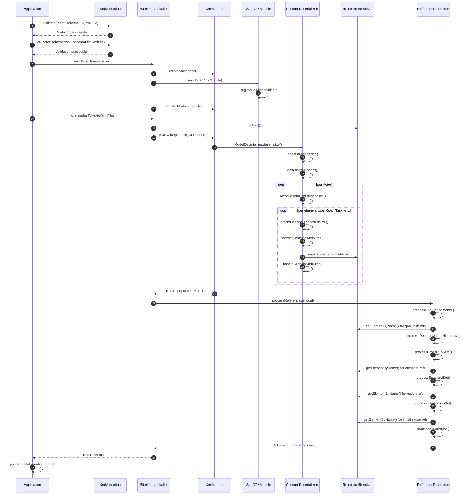

```mermaid
sequenceDiagram
autonumber
participant App as Application
participant Val as XmlValidation
participant Unm as IStarUnmarshaller
participant XMap as XmlMapper
participant Mod as IStarDTXModule
participant Des as Custom Deserializers
participant RefRes as ReferenceResolver
participant RefProc as ReferenceProcessor

    App->>Val: validate("xsd", schemaFile, xmlFile)
    Val-->>App: Validation successful
    App->>Val: validate("schematron", schemaFile, xmlFile)
    Val-->>App: Validation successful
    
    App->>Unm: new IStarUnmarshaller()
    Unm->>XMap: createXmlMapper()
    Unm->>Mod: new IStarDTXModule()
    Mod->>Mod: Register all deserializers
    Unm->>XMap: registerModule(module)
    
    App->>Unm: unmarshalToModel(xmlFile)
    Unm->>RefRes: clear()
    Unm->>XMap: readValue(xmlFile, Model.class)
    
    XMap->>Des: ModelDeserializer.deserialize()
    Des->>Des: deserializeHeader()
    Des->>Des: deserializeOptions()
    
    loop per Actor
        Des->>Des: ActorDeserializer.deserialize()
        
        loop per element type: Goal, Task, etc.
            Des->>Des: ElementDeserializer.deserialize()
            Des->>Des: extractCommonAttributes()
            Des->>RefRes: registerElement(id, element)
            Des->>Des: handleSpecificAttributes()
        end
    end
    
    XMap-->>Unm: Return populated Model
    
    Unm->>RefProc: processReferences(model)
    
    RefProc->>RefProc: processGoalRefinements()
    RefProc->>RefRes: getElementByName() for goal/task refs
    RefProc->>RefProc: processDecompositionHierarchy()
    RefProc->>RefProc: processCrossRunSets()
    RefProc->>RefRes: getElementByName() for crossrun refs
    RefProc->>RefProc: processExportedSet()
    RefProc->>RefRes: getElementByName() for export refs
    RefProc->>RefProc: processInitializationSet()
    RefProc->>RefRes: getElementByName() for initialization refs
    
    
    RefProc->>RefProc: processAllFormulas()

    RefProc-->>Unm: Reference processing done
    Unm-->>App: Return Model
    App->>App: printModelInformation(model)
```