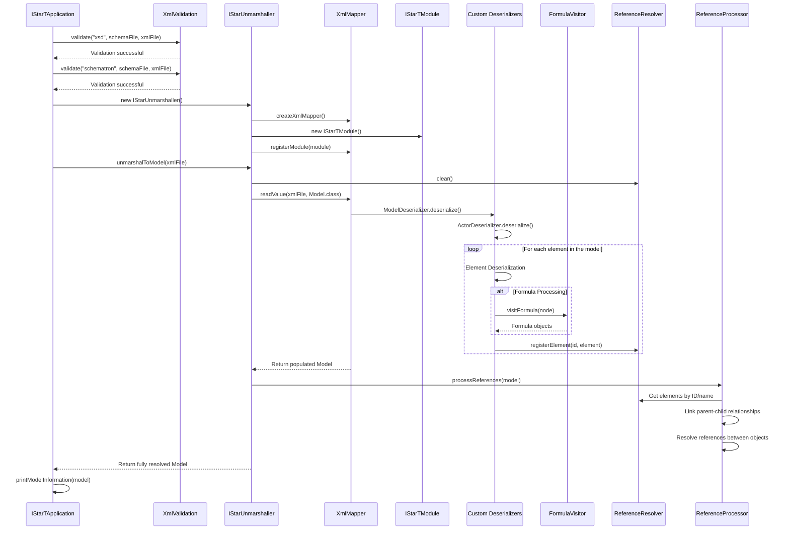

```mermaid
sequenceDiagram
participant App as IStarTApplication
participant Val as XmlValidation
participant Unm as IStarUnmarshaller
participant XMap as XmlMapper
participant Mod as IStarTModule
participant Des as Custom Deserializers
participant FVisit as FormulaVisitor
participant RefRes as ReferenceResolver
participant RefProc as ReferenceProcessor

    App->>Val: validate("xsd", schemaFile, xmlFile)
    Val-->>App: Validation successful
    App->>Val: validate("schematron", schemaFile, xmlFile)
    Val-->>App: Validation successful
    
    App->>Unm: new IStarUnmarshaller()
    Unm->>XMap: createXmlMapper()
    Unm->>Mod: new IStarTModule()
    Unm->>XMap: registerModule(module)
    
    App->>Unm: unmarshalToModel(xmlFile)
    Unm->>RefRes: clear()
    Unm->>XMap: readValue(xmlFile, Model.class)
    
    XMap->>Des: ModelDeserializer.deserialize()
    Des->>Des: ActorDeserializer.deserialize()
    
    loop For each element in the model
        Des->>Des: Element Deserialization
        alt Formula Processing
            Des->>FVisit: visitFormula(node)
            FVisit-->>Des: Formula objects
        end
        Des->>RefRes: registerElement(id, element)
    end
    
    XMap-->>Unm: Return populated Model
    
    Unm->>RefProc: processReferences(model)
    RefProc->>RefRes: Get elements by ID/name
    RefProc->>RefProc: Link parent-child relationships
    RefProc->>RefProc: Resolve references between objects
    
    Unm-->>App: Return fully resolved Model
    App->>App: printModelInformation(model)
```