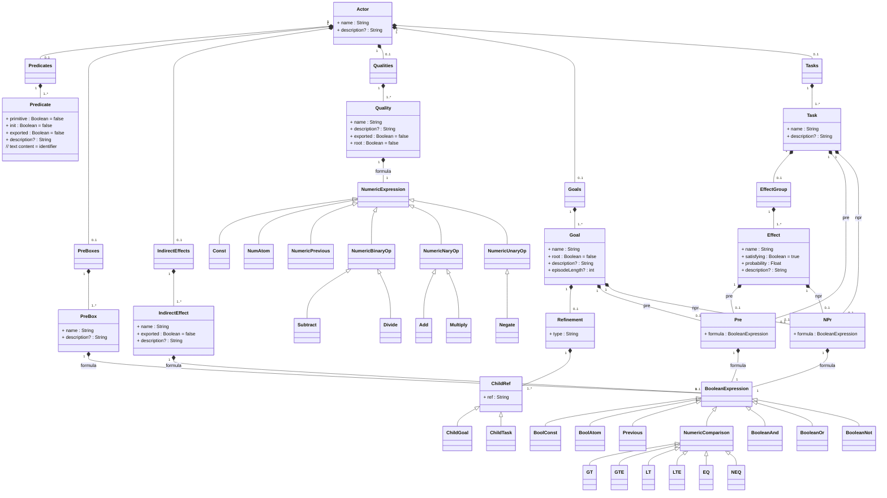

```mermaid
classDiagram
    %% Actor aggregates
    Actor "1" *-- "0..1" Predicates
    Actor "1" *-- "0..1" PreBoxes
    Actor "1" *-- "0..1" IndirectEffects
    Actor "1" *-- "0..1" Qualities
    Actor "1" *-- "0..1" Goals
    Actor "1" *-- "0..1" Tasks

    Predicates "1" *-- "1..*" Predicate
    PreBoxes "1" *-- "1..*" PreBox
    IndirectEffects "1" *-- "1..*" IndirectEffect
    Qualities "1" *-- "1..*" Quality
    Goals "1" *-- "1..*" Goal
    Tasks "1" *-- "1..*" Task

    %% Goal decomposition
    Goal "1" *-- "0..1" Refinement
    Refinement "1" *-- "1..*" ChildRef
    ChildRef <|-- ChildGoal
    ChildRef <|-- ChildTask

    %% Task effects
    Task "1" *-- "0..1" EffectGroup
    EffectGroup "1" *-- "1..*" Effect

    %% Boolean / Numeric Expression hierarchies
    BooleanExpression <|-- BoolConst
    BooleanExpression <|-- BoolAtom
    BooleanExpression <|-- Previous
    BooleanExpression <|-- NumericComparison
    BooleanExpression <|-- BooleanAnd
    BooleanExpression <|-- BooleanOr
    BooleanExpression <|-- BooleanNot

    NumericExpression <|-- Const
    NumericExpression <|-- NumAtom
    NumericExpression <|-- NumericPrevious
    NumericExpression <|-- NumericBinaryOp
    NumericExpression <|-- NumericNaryOp
    NumericExpression <|-- NumericUnaryOp

    NumericComparison <|-- GT
    NumericComparison <|-- GTE
    NumericComparison <|-- LT
    NumericComparison <|-- LTE
    NumericComparison <|-- EQ
    NumericComparison <|-- NEQ

    NumericBinaryOp <|-- Subtract
    NumericBinaryOp <|-- Divide
    NumericNaryOp <|-- Add
    NumericNaryOp <|-- Multiply
    NumericUnaryOp <|-- Negate

    %% PreBox, IndirectEffect & Quality now compose the correct expression types
    PreBox       "1" *-- "1" BooleanExpression : formula
    IndirectEffect "1" *-- "0..1" BooleanExpression : formula
    Quality      "1" *-- "1" NumericExpression : formula
    Pre          "1" *-- "1" BooleanExpression : formula
    NPr          "1" *-- "1" BooleanExpression : formula

    %% Goal pre/npr
    Goal "1" *-- "0..1" Pre  : pre
    Goal "1" *-- "0..1" NPr  : npr

    %% Task pre/npr
    Task "1" *-- "0..1" Pre  : pre
    Task "1" *-- "0..1" NPr  : npr

    %% Effect pre/npr
    Effect "1" *-- "0..1" Pre  : pre
    Effect "1" *-- "0..1" NPr  : npr

    %% Classes
    class Actor {
      + name : String
      + description? : String
    }

    class Predicates
    class PreBoxes
    class IndirectEffects
    class Qualities
    class Goals
    class Tasks

    class Predicate {
      + primitive : Boolean = false
      + init      : Boolean = false
      + exported  : Boolean = false
      + description? : String
      // text content = identifier
    }

    class PreBox {
      + name : String
      + description? : String
    }

    class IndirectEffect {
      + name : String
      + exported : Boolean = false
      + description? : String
    }

    class Quality {
      + name : String
      + description? : String
      + exported : Boolean = false
      + root     : Boolean = false
    }

    class Goal {
      + name : String
      + root : Boolean = false
      + description? : String
      + episodeLength? : int
    }
    class Refinement {
      + type : String
    }
    class ChildRef {
      + ref : String
    }
    class ChildGoal
    class ChildTask

    class Task {
      + name        : String
      + description? : String
    }

    class EffectGroup
    class Effect {
      + name        : String
      + satisfying  : Boolean = true
      + probability : Float
      + description? : String
    }

    class Pre {
    + formula : BooleanExpression
    }
    class NPr {
      + formula : BooleanExpression
    }

    class BoolConst
    class BoolAtom
    class Previous
    class BooleanAnd
    class BooleanOr
    class BooleanNot
    class NumericComparison
    class GT
    class GTE
    class LT
    class LTE
    class EQ
    class NEQ

    class Const
    class NumAtom
    class NumericPrevious
    class NumericBinaryOp
    class NumericNaryOp
    class NumericUnaryOp
    class Subtract
    class Divide
    class Add
    class Multiply
    class Negate
```