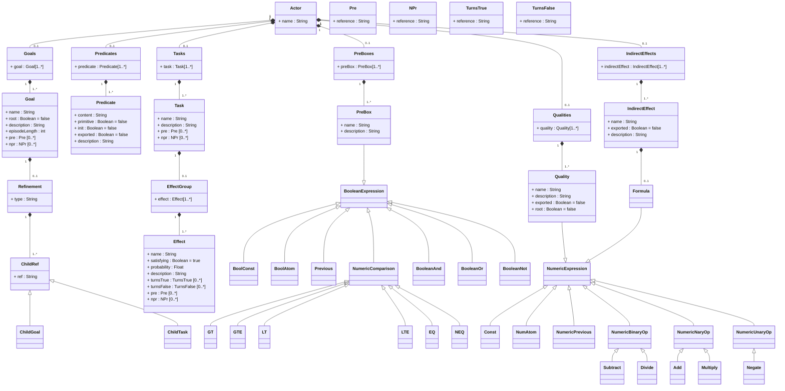

```mermaid
classDiagram
    %% Associations and Compositions
    Actor "1" *-- "0..1" Predicates
    Actor "1" *-- "0..1" PreBoxes
    Actor "1" *-- "0..1" IndirectEffects
    Actor "1" *-- "0..1" Qualities
    Actor "1" *-- "0..1" Goals
    Actor "1" *-- "0..1" Tasks

    Predicates "1" *-- "1..*" Predicate
    PreBoxes "1" *-- "1..*" PreBox
    IndirectEffects "1" *-- "1..*" IndirectEffect
    Qualities "1" *-- "1..*" Quality
    Goals "1" *-- "1..*" Goal
    Tasks "1" *-- "1..*" Task

    Goal "1" *-- "0..1" Refinement
    Refinement "1" *-- "1..*" ChildRef
    ChildRef <|-- ChildGoal
    ChildRef <|-- ChildTask

    Task "1" *-- "0..1" EffectGroup
    EffectGroup "1" *-- "1..*" Effect

    IndirectEffect "1" *-- "0..1" Formula

    %% Inheritance / Generalization
    BooleanExpression <|-- BoolConst
    BooleanExpression <|-- BoolAtom
    BooleanExpression <|-- Previous
    BooleanExpression <|-- NumericComparison
    BooleanExpression <|-- BooleanAnd
    BooleanExpression <|-- BooleanOr
    BooleanExpression <|-- BooleanNot

    NumericComparison <|-- GT
    NumericComparison <|-- GTE
    NumericComparison <|-- LT
    NumericComparison <|-- LTE
    NumericComparison <|-- EQ
    NumericComparison <|-- NEQ

    NumericExpression <|-- Const
    NumericExpression <|-- NumAtom
    NumericExpression <|-- NumericPrevious
    NumericExpression <|-- NumericBinaryOp
    NumericExpression <|-- NumericNaryOp
    NumericExpression <|-- NumericUnaryOp

    NumericBinaryOp <|-- Subtract
    NumericBinaryOp <|-- Divide
    NumericNaryOp <|-- Add
    NumericNaryOp <|-- Multiply
    NumericUnaryOp <|-- Negate

    %% Interface / Implementation
    PreBox --|> BooleanExpression
    Quality --|> NumericExpression
    Formula --|> NumericExpression

    %% Class Definitions
    class Actor {
      + name : String
    }

    class Predicates {
      + predicate : Predicate[1..*]
    }

    class PreBoxes {
      + preBox : PreBox[1..*]
    }

    class IndirectEffects {
      + indirectEffect : IndirectEffect[1..*]
    }

    class Qualities {
      + quality : Quality[1..*]
    }

    class Goals {
      + goal : Goal[1..*]
    }

    class Tasks {
      + task : Task[1..*]
    }

    class Predicate {
      + content : String
      + primitive : Boolean = false
      + init      : Boolean = false
      + exported  : Boolean = false
      + description : String
    }

    class PreBox {
      + name        : String
      + description : String
    }

    class IndirectEffect {
      + name        : String
      + exported    : Boolean = false
      + description : String
    }

    class Quality {
      + name        : String
      + description : String
      + exported    : Boolean = false
      + root        : Boolean = false
    }

    class Goal {
      + name          : String
      + root          : Boolean = false
      + description   : String
      + episodeLength : int
      + pre           : Pre [0..*]
      + npr           : NPr [0..*]
    }

    class Refinement {
      + type : String
    }

    class ChildRef {
      + ref : String
    }

    class ChildGoal
    class ChildTask

    class Task {
      + name        : String
      + description : String
      + pre         : Pre [0..*]
      + npr         : NPr [0..*]
    }

    class EffectGroup {
      + effect : Effect[1..*]
    }

    class Effect {
      + name        : String
      + satisfying  : Boolean = true
      + probability : Float
      + description : String
      + turnsTrue   : TurnsTrue [0..*]
      + turnsFalse  : TurnsFalse [0..*]
      + pre         : Pre [0..*]
      + npr         : NPr [0..*]
    }

    class Pre {
      + reference : String
    }

    class NPr {
      + reference : String
    }

    class TurnsTrue {
      + reference : String
    }

    class TurnsFalse {
      + reference : String
    }

    %% Expression Hierarchy Classes
    class BooleanExpression
    class BoolConst
    class BoolAtom
    class Previous
    class NumericComparison
    class BooleanAnd
    class BooleanOr
    class BooleanNot

    class GT
    class GTE
    class LT
    class LTE
    class EQ
    class NEQ

    class NumericExpression
    class Const
    class NumAtom
    class NumericPrevious
    class NumericBinaryOp
    class NumericNaryOp
    class NumericUnaryOp

    class Subtract
    class Divide
    class Add
    class Multiply
    class Negate

    class Formula
```